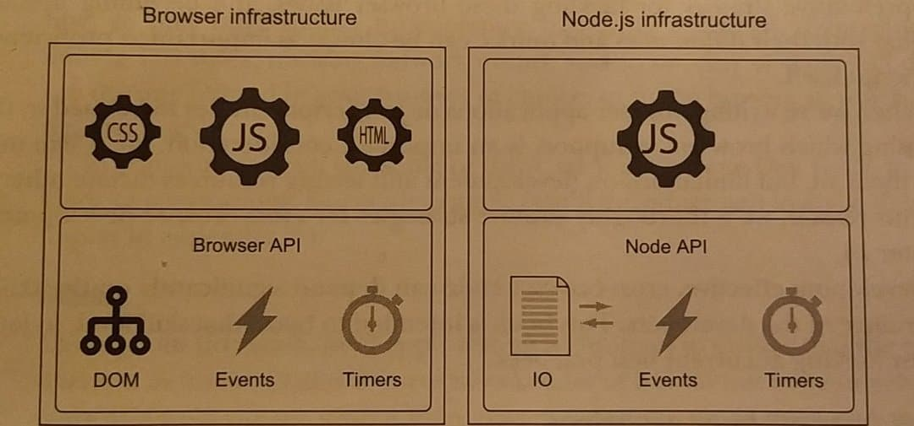

# Javascript is everywhere

***This chapter cover***

* The core language features of Javascript
* The core items of Javascript engine
* Three best practices in JavaScript development 

Let´s start this summary talking about Bob who is a software development, who graduated in 2000's after learn how create desktop application. As the web pages had just hit stride he learned PHP so he could create dynamic web pages sprinkled with JavaScript to achieve complex functionalities like form validations. When the smartphones arrived, they opened a new market and bob didn’t want keep back and learned Objective-C and Java to develop mobile apps that run on IOS and Android. Now lets talk about Ann who graduated with a degree in software development. She made web sites based on the modern Model-View-Controller, also made mobile applications that running on IOS and Android, she got to make desktop applications that runs on Windows, Linux and OS X, she has started to building a server less version of that applications entirely based in the cloud. Everything written in JavaScript. That was extraordinary because what took Bob 10 years and 5 languages to do, Ann has achieved in 2 years and in just one language. What started as a humble 10-day project back in 1995 is now one of the most widely used programming languages in the world, now JavaScript is getting long overdue upgrades to be more suitable for modern application development.

**1.1 Understanding the JavaScript language**

Using a vast number of elements in the languages is not enough to take beyond fundamental levels because JavaScript often using a C-like syntax because it  has a resemblance to others C-like languages such C# and Java. People often think if they know C# or Java they know JavaScript but the reality is other and they check it after writing JavaScript as if it were Java and the results are other that they expected. 

These differences include the following:

* *Functions are fist class objects* - Function can coexist and be treated like any other JavaScript objet. They can be created through literals, referenced by variables, passed around as function arguments an event return as function return values.

* *Function clouser* - Function is a closure when it actively maintains the external variables used in its body.

* *Scopes* - JavaScript didn’t have block levels variables as other C-like languages and we had to rely on global variables and function level variables. 

* *Prototype-base object orientation* - JavaScript instead use class-based object orientation like C#, Java and Ruby, uses prototypes. Many developers that come from class-based languages such Java try to use Java using the syntax of JavaScript and they have  a big impression because the results are differ than they expected. 

JavaScript consist of a close relationship between objects and prototypes and prototypes, and functions and closures, understanding those concepts you will have a strong foundation for any type of application development, regardless of whether your JavaScript code will be executed in a desktop application, web page, mobile app or on the server. 

Also exist other features of JavaScript can help you to write more elegant and efficient code in particular we will focus on the following: 

*Generators* - are function that can generate multiple values on a per-request and can suspend their execution between request. 

*Promises* - give us better control over asynchronous code 

*Proxies* -  allow us to control access to certain objects 

*Advanced array methods* - make array-handling code much more elegant 

*Maps* - we can use to create dictionary collections and sets which allow us to deal with collections of unique items. 

*Regular expression* - let us simplify what would otherwise be complicated pieces of code 

*Modules* - we can use to break code into smaller, relatively self-contained pieces that make projects more manageable 

Having a deep understanding of the fundaments and learning how to use the advanced language features to their best advantages can elevate your code to higher levels 

**1.1.1 How will JavaScript evolve**

The ECSMASccript committee in charge of standardizing the language has just finished the ES7/2016 version, a small upgrade to JavaScript compared with ES6, because the committee's goal going forward is to focus on smaller 

Yearly exist updates for the languages but it doesn’t mean that developers will have access to those new features that have been released so we keep waiting for new JavaScript engines that have the new features. Unfortunately there’s always a chances that you’ll run into features that you want to use but that are yet to be supported. 

**1.1.2 Transpiliers give us access to tomorrow’s JavaScript today** 

With the rapid release cycles of browsers we don’t have to wait long for a JavaScript features to be supported but the user of our web application may still using older browsers? One answer could be use transpilers *(transformation + compiling)* are tools that take the cutting edge of JavaScript code and transform it into equivalent (or similar) code that works properly in most current browsers and one of the most popular in transpilier is Traceur. 

**1.2 Understanding the browser**

These days, JavaScript applications can be executed in many environments, but the environments from which all other environment have taken ideas, and the environment on which we’ll focus us the browser. The browser provides various concepts and APIs to thoroughly explore see figure 1.1 

##### **Figure1.1 Client-side web application rely on the infraestructure provided by the browser. We'll particularly focus on the DOM, events, tumers, and browser APIs.**

We’ll concentrate on the following:

*The Document Object Model (DOM)* – The DOM is a structured representation of the UI of a client-side web application that is built from the HTML code of a web application to develop great applications you need to not only have a deep understanding of the core JavaScript mechanics. 

*Events* –  Many JavaScript application are event-driven applications, it means the most code executed is in response of a particular event. Examples of events include network events, timers and user-generate events such as clicks, mouse moves, keyboard presses and so on. 

*Browser API* – The browsers offers an API that allow us to access information about devices, store data locally or communicate with remote servers  

The browsers has improved but they still have some bugs, missing APIs and some browsers-specific quirks that we nee to deal with. We need to develop strategies to deal with those issues and becoming familiar with their differences and quirks. 

When we write browser application or JavaScript libraries to be used in them we need choose admit them because the reality is that no all the browsers admit all the libraries or applications. 

**1.3 Using current best practices**

Mastery of the JavaScript language and a strong understanding of coding issues are important parts of becoming an expert web application developer. You need to exhibit the traits that scores of previous developers have proven. Thess traits are known as *best practices* they include such elements as

* Debbugging skills
* Testing
* Performance analysis

Those are important to adhere to theses practices when coding

**1.3.1 Debugging**

